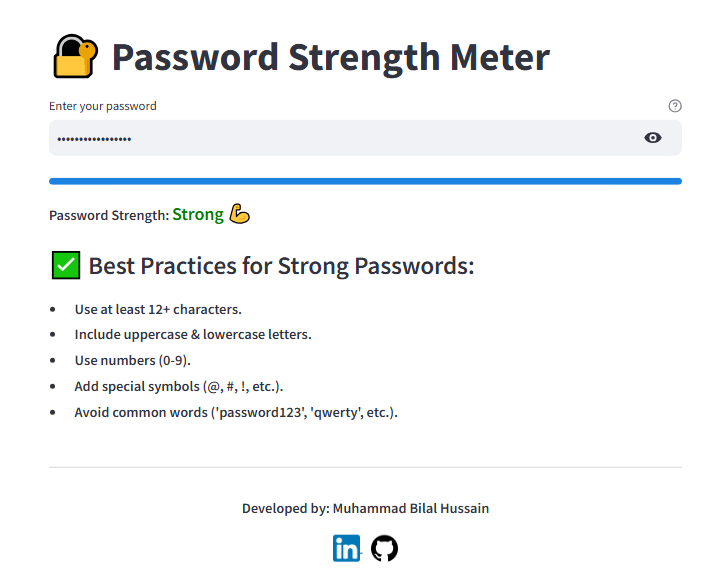

# 🔐 Password Strength Meter

A simple yet effective **Password Strength Meter** built with **Python & Streamlit** to help users create strong and secure passwords.

🚀 **Live Demo**: <a href="https://password-checker-bilal.streamlit.app/" target="_blank">Password Strength Checker</a>

---

## 📌 Features
✔️ Checks password strength based on **length, uppercase, lowercase, numbers, and special characters**.  
✔️ Provides **real-time feedback** to improve password security.  
✔️ Displays **password strength level (Weak, Moderate, Strong)** with **color indicators**.  
✔️ Uses a **progress bar** to visually indicate strength.  
✔️ Offers **best password security practices**.  
✔️ Clean, minimal, and **user-friendly UI** with Streamlit.  

---

## 🛠️ Installation & Usage

### 1️⃣ **Clone the Repository**
```sh
git clone https://github.com/Bilal0335/02_password_strength_meter_with_python_-_streamlit.git
cd 02_password_strength_meter_with_python_-_streamlit
```

### 2️⃣ **Install Dependencies**
Make sure you have Python installed. Then, run:
```sh
pip install -r requirements.txt
```

### 3️⃣ **Run the App**
```sh
streamlit run app.py
```

Now, open the **local link** displayed in the terminal and start testing your passwords! 🎉

---

## 🖥️ **Screenshots**


---

## 🌟 **Connect with Me**
🔗 **GitHub**: [Bilal0335](https://github.com/Bilal0335)  
🔗 **LinkedIn**: [Bilal Hussain](https://www.linkedin.com/in/bilalcode01/)  

📌 **Developed by:** *Muhammad Bilal Hussain*

